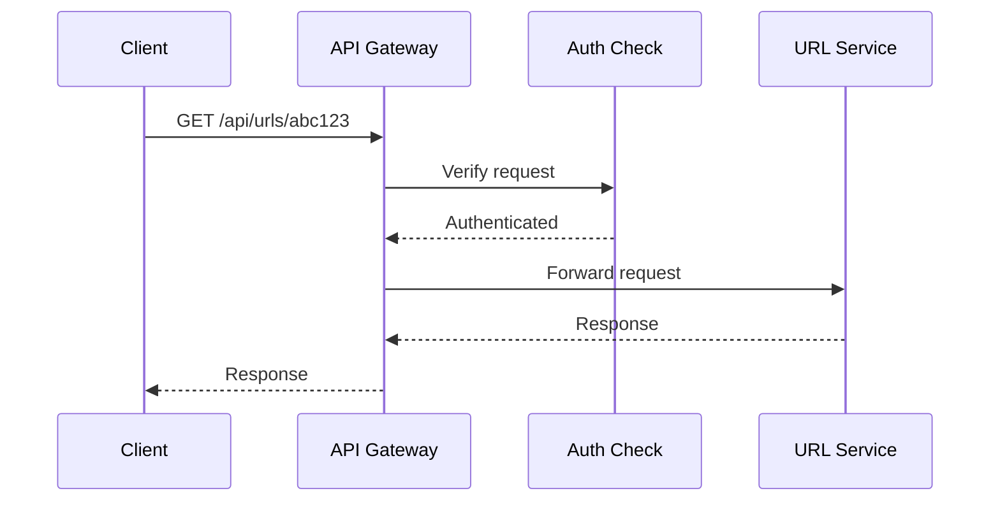

# 🚪 The API Gateway Pattern

## A Single, Deliberate Entry Point for Many Services

[breaking-systems-into-components.md](../system-design-foundations/breaking-systems-into-components.md),
earlier in this domain, split a system into multiple, independent services. But if every client
needed to know the specific address of every individual service, that split would leak directly
into every client's own code. The **API Gateway** pattern solves exactly this — one single,
unified entry point in front of an entire microservices architecture.

## The Core Idea

```
WITHOUT an API Gateway: a client (a mobile app, a web frontend)
  calls the URL Service, the Analytics Service, and the User
  Service DIRECTLY, each at its OWN separate address.

WITH an API Gateway: the client talks to ONE address - the
  gateway routes each request to whichever internal service
  actually handles it.
```

This is directly the [Facade Pattern](../../low-level-design/structural-design-patterns/facade-pattern.md),
already covered in the Low-Level Design domain — genuinely applied here at the architectural level:
the gateway provides one simple, unified interface hiding the real complexity of the underlying
microservices, exactly Facade's core purpose, now at system scale rather than class scale.

## What an API Gateway Actually Handles

```
- ROUTING requests to the correct internal service
- AUTHENTICATION - verifying a request's identity ONCE, at the
  gateway, rather than in EVERY individual service
- RATE LIMITING - protecting the entire system from being
  overwhelmed (directly previewing Rate Limiting, covered in
  full in Advanced Distributed Systems Concepts, later in this
  domain)
- LOAD BALANCING - directly building on load-balancing.md, the
  previous file in this module
```

Centralizing these cross-cutting concerns at the gateway means each individual microservice doesn't
need to reimplement authentication or rate limiting itself — a genuinely significant reduction in
duplicated logic across a real microservices architecture.

## A Concrete Request Flow



This directly applies [UML Basics](../../low-level-design/lld-foundations/uml-basics.md)'s sequence
diagram notation, already covered in the LLD domain — now at the system-architecture level, showing
exactly how a request actually flows through the gateway before reaching a genuine backend service.

## Protecting Internal Services From Direct Public Exposure

```
Directly the SAME principle already established in Reverse Proxy
Concepts, in this repository's Production Systems domain: internal
services are NEVER directly, publicly reachable - the API Gateway
is the ONLY publicly exposed entry point, meaningfully reducing
the system's overall attack surface.
```

This is a genuinely important security benefit beyond pure convenience — directly extending
[attack-surface.md](../../../web-security/the-security-mindset/attack-surface.md), earlier in this
repository's Web Security domain: fewer publicly exposed entry points means fewer places an
attacker can directly probe.

## The Genuine Risk: a Single Point of Failure

```
If the API GATEWAY itself goes down, EVERY service behind it
becomes UNREACHABLE, even if every individual service is perfectly
healthy - directly previewing Fault Tolerance and Failure Handling,
covered in full later in this domain.
```

This is a real, important trade-off worth naming explicitly — centralizing traffic through one
gateway creates real convenience and security benefits, but also concentrates risk; a genuinely
production-grade API Gateway needs its own redundancy (multiple gateway instances, load-balanced)
to avoid becoming this exact single point of failure.

## Common Mistakes

- Implementing authentication logic separately in every individual microservice instead of
  centralizing it once at the gateway.
- Running only a single API Gateway instance with no redundancy, turning it into an unaddressed
  single point of failure for the entire system.
- Letting the gateway accumulate genuine business logic beyond routing and cross-cutting concerns,
  blurring its focused, Facade-like responsibility.

## ➡️ Next

Continue to [message-queues.md](message-queues.md) to see how services communicate asynchronously,
rather than only through direct, synchronous requests routed by the gateway.
