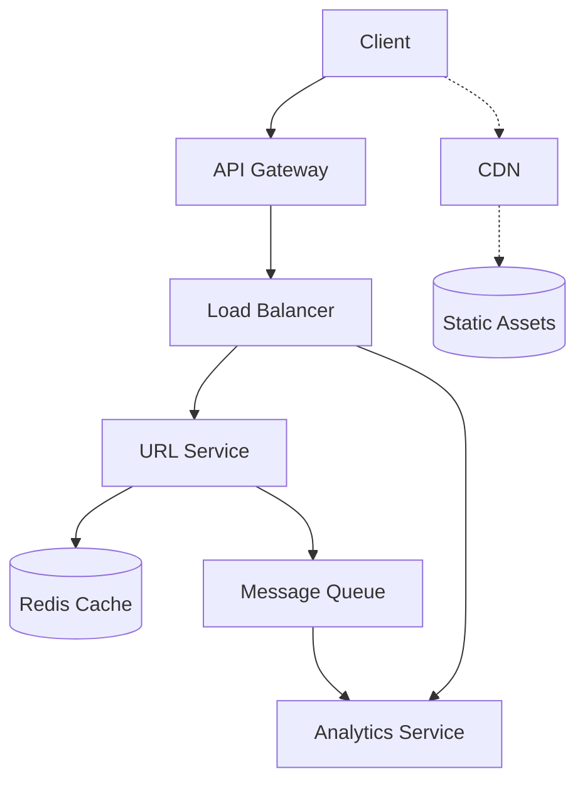

# 🧱 Microservices Fundamentals

## Every Piece of This Module, Brought Together

[Caching](caching-strategies.md), [CDNs](cdns-and-content-delivery.md),
[Load Balancing](load-balancing.md), the [API Gateway](api-gateway-pattern.md), and
[Message Queues](message-queues.md) are the concrete infrastructure that makes a real
**microservices architecture** — independently deployable services, each with a genuine, focused
responsibility — actually work at scale.

## The Monolith-First Principle

```
The current, widely-held consensus among experienced architects:
"most teams should start MONOLITHIC and decompose into
microservices only when the monolith's COUPLING becomes a REAL
bottleneck - not preemptively."
```

This is directly the same "start simple" principle already established repeatedly throughout this
repository — first for AI agent architectures in
[when-to-use-multi-agent-systems-and-when-not-to.md](../../../artificial-intelligence/understanding-ai-agents/when-to-use-multi-agent-systems-and-when-not-to.md),
then for service decomposition in
[breaking-systems-into-components.md](../system-design-foundations/breaking-systems-into-components.md),
earlier in this domain — the same underlying discipline, now confirmed as the genuine, current
industry consensus for microservices specifically.

## The Real Trade-Off, Stated Precisely

```
MONOLITH: simpler to develop, deploy, and operate - but scaling
  ANY one part means scaling the WHOLE application, and a change
  requires redeploying EVERYTHING together.

MICROSERVICES: each service scales and deploys INDEPENDENTLY -
  but genuine operational complexity (service discovery,
  distributed tracing, network reliability) grows with the
  NUMBER of services.
```

This is worth stating precisely because it's genuinely a trade-off, not a strict improvement —
microservices solve real problems (independent scaling, independent deployment, team autonomy) at
the real cost of meaningfully more operational complexity, directly requiring every piece of
infrastructure this module has covered.

## How This Module's Pieces Fit Together



Every piece already covered in this module has a genuine, distinct role here: the **API Gateway**
provides one entry point; the **load balancer** distributes traffic within each service; a
**cache** speeds up reads; a **message queue** decouples the URL Service from Analytics
processing; and a **CDN** serves static assets entirely separately, closer to each user.

## Containerization: the Practical Deployment Unit

```
Each microservice is typically deployed as its OWN container
(directly extending Docker and Containerization, already covered
in this repository's Production Systems domain) - genuinely
independent deployment, scaling, and even TECHNOLOGY CHOICE per
service.
```

This directly connects HLD's architectural decisions to the concrete deployment mechanics already
covered in [Docker and Containerization](../../../production-systems/docker-and-containerization/) —
a microservices architecture on paper needs exactly this kind of independently deployable unit to
actually be realized in practice.

## Common Mistakes

- Adopting microservices preemptively, before a monolith's actual coupling has genuinely become a
  real, demonstrated bottleneck — directly the same premature-complexity risk already warned
  against for AI agent architectures, earlier in this repository.
- Splitting services along organizational lines rather than genuine functional and scaling
  boundaries, per [breaking-systems-into-components.md](../system-design-foundations/breaking-systems-into-components.md).
- Underestimating the genuine operational complexity (service discovery, distributed tracing,
  network reliability) that grows directly with the number of independent services.

## Module Summary

Across this module: **caching strategies** — cache-aside and write-through, verified against AWS's
official guidance — directly apply the memory-vs-disk latency lesson from earlier in this domain
(see [caching-strategies.md](caching-strategies.md)); **CDNs** extend caching across geography,
using Points of Presence and edge servers to serve static content close to users worldwide (see
[cdns-and-content-delivery.md](cdns-and-content-delivery.md)); **load balancing** algorithms —
round robin, least connections, IP hash — each fit genuinely different traffic characteristics,
enabling real horizontal scaling (see [load-balancing.md](load-balancing.md)); the **API Gateway**
applies the Facade pattern at architecture scale, centralizing authentication and routing behind one
entry point (see [api-gateway-pattern.md](api-gateway-pattern.md)); **message queues** enable
genuine asynchronous decoupling between services, verified against AWS's official
producer/queue/consumer model (see [message-queues.md](message-queues.md)); and **microservices**
bring every piece together, earning their real operational complexity only when a monolith's
genuine coupling has become a demonstrated bottleneck — never adopted preemptively.
