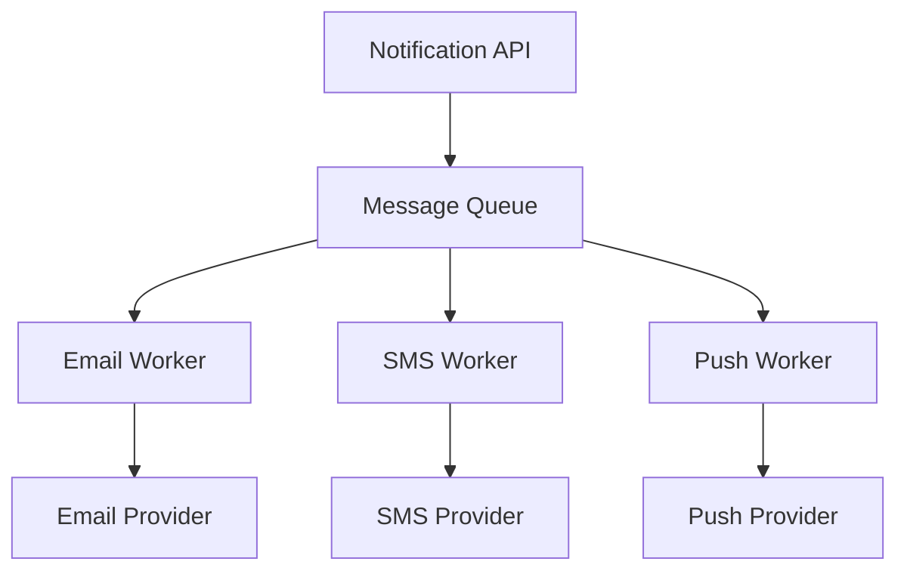

# 🔔 Designing a Notification System

## A Third Worked Example: Genuine Fan-Out at Scale

[designing-a-url-shortener.md](designing-a-url-shortener.md) and
[designing-a-rate-limiter.md](designing-a-rate-limiter.md) each covered one specific architectural
challenge. A **Notification System** — sending an email, SMS, or push notification, potentially to
millions of users at once — brings together message queues, multiple delivery channels, and a
genuinely important idempotency concern, closing out this domain's worked examples.

## Step 1: Clarify Requirements

```
FUNCTIONAL: send a notification via EMAIL, SMS, or PUSH; support
  BOTH a single-user notification and a BROADCAST to millions of
  users at once; track DELIVERY status

NON-FUNCTIONAL: a broadcast to millions of users must NOT block
  or slow the system sending it; a notification should be
  delivered AT LEAST once (never silently lost); duplicate
  delivery should be genuinely rare
```

The "at least once, duplicates rare" requirement is worth flagging immediately — it directly
foreshadows this file's idempotency discussion, later in this file.

## Step 2: High-Level Architecture



Directly applying [message-queues.md](../core-infrastructure/message-queues.md)'s producer/queue/
consumer model, earlier in this domain — the Notification API is purely a *producer*, queuing a
message and returning immediately, while separate, independent *consumer* workers handle each
delivery channel asynchronously.

## Step 3: Handling a Broadcast to Millions of Users

```
A SINGLE "notify all users" request CANNOT reasonably enqueue
MILLIONS of individual messages synchronously, in one API call -
directly the SAME asynchronous-processing justification already
established in message-queues.md.
```

```python
def broadcast_notification(message, user_segment):
    queue.enqueue({"type": "broadcast", "message": message, "segment": user_segment})
    return {"status": "queued"}   # returns IMMEDIATELY

# A SEPARATE background worker FANS OUT the broadcast:
def process_broadcast(broadcast_job):
    for user_id in get_users_in_segment(broadcast_job["segment"]):
        queue.enqueue({"type": "single", "user_id": user_id, "message": broadcast_job["message"]})
```

This two-stage fan-out — one job that expands into many individual jobs — keeps the original API
call fast and simple, while the genuinely large-scale work of processing millions of individual
notifications happens entirely asynchronously, in the background.

## Step 4: Idempotency — Never Sending a Duplicate

```
Per this file's own "at least once" requirement, a WORKER could
genuinely CRASH after sending a notification but BEFORE marking
it as sent - on RETRY, without idempotency, the SAME notification
would be sent AGAIN.
```

```python
def send_email_notification(notification_id, user_id, message):
    if already_sent(notification_id):   # an idempotency check,
        return                            # per REST API Design's own
                                            # idempotency-key concept,
                                            # earlier in this domain
    email_provider.send(user_id, message)
    mark_as_sent(notification_id)
```

This directly applies
[designing-rest-apis-at-scale.md](../communication-and-data-layer/designing-rest-apis-at-scale.md)'s
idempotency concept, earlier in this domain — a unique `notification_id`, checked *before* actually
sending, ensures a retried job (from a crashed worker, or a genuine message-queue redelivery)
doesn't cause a user to receive the same notification twice.

## Step 5: Handling a Delivery Provider Failure

```
Directly per fault-tolerance-and-failure-handling.md, earlier in
this domain: if the EMAIL provider is temporarily failing, a
CIRCUIT BREAKER prevents the Email Worker from continuing to
hammer it - while SMS and Push workers, entirely INDEPENDENT,
continue operating normally.
```

This is a direct, concrete application of graceful degradation — one delivery channel's failure
never cascades into the other two channels also failing, precisely because each worker operates
genuinely independently.

## Rate Limiting the Notification System Itself

```
Directly per designing-a-rate-limiter.md, earlier in this module:
a SINGLE user shouldn't be able to trigger an UNBOUNDED number of
notifications (a genuine abuse-prevention concern) - the SAME
rate-limiting infrastructure already designed protects this
system too.
```

## Common Mistakes

- Processing a broadcast to millions of users synchronously within the original API request,
  causing it to time out or block entirely.
- Omitting idempotency checks, risking duplicate notification delivery whenever a worker crashes
  and a message is genuinely, correctly retried.
- Coupling all three delivery channels together so tightly that one provider's failure blocks the
  other two channels from continuing to operate.

## Module Summary

Across this module: **the URL Shortener**, the running example from every prior module in this
domain, is brought to a complete conclusion — applying the four-step process, Base62 encoding with
distributed ID generation, and a deep-dive into its critical, read-heavy redirect path (see
[designing-a-url-shortener.md](designing-a-url-shortener.md)); **the rate limiter** demonstrates
why distributed systems need shared, centralized state (Redis) rather than local, per-instance
counters, and the genuine fail-open-vs-fail-closed trade-off when that shared dependency itself
fails (see [designing-a-rate-limiter.md](designing-a-rate-limiter.md)); and **the notification
system** brings together message-queue-based fan-out, per-channel independence for graceful
degradation, and idempotent delivery to prevent duplicates — closing out this entire High-Level
Design domain by applying every concept covered, from requirements analysis through fault
tolerance, to three genuinely different, complete, real-world problems.
