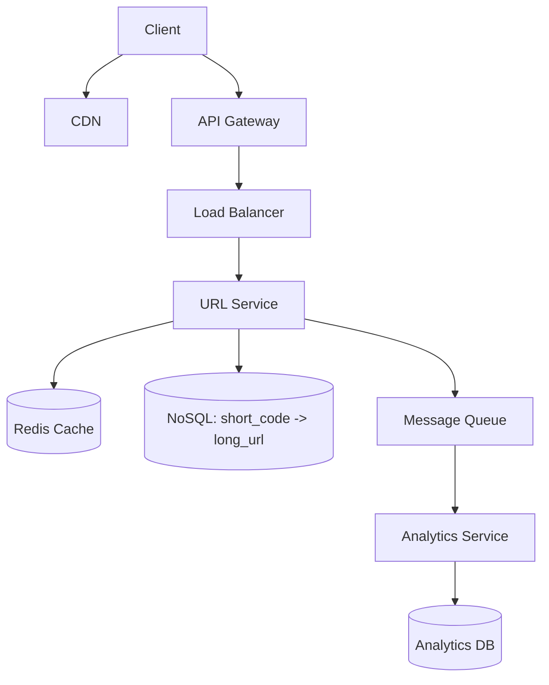

# 🔗 Designing a URL Shortener

## Bringing the Running Example to a Complete Conclusion

Every module in this domain has used the URL Shortener as a running example — requirements in
[System Design Foundations](../system-design-foundations/), data layer decisions in
[Communication and Data Layer](../communication-and-data-layer/), infrastructure in
[Core Infrastructure](../core-infrastructure/), and reliability concerns in
[Advanced Distributed Systems Concepts](../advanced-distributed-systems/). This file finally brings
every piece together into one complete, structured walkthrough — applying the four-step process
from [approaching-a-system-design-problem.md](../system-design-foundations/approaching-a-system-design-problem.md).

## Step 1: Clarify Requirements

```
FUNCTIONAL: submit a long URL, receive a short one; visiting the
  short URL redirects to the original; optional custom alias;
  optional expiration

NON-FUNCTIONAL: 100M creations/day, ~100x that in redirects;
  sub-100ms redirect latency; 99.99% availability for redirects
  specifically (per Reliability and Availability, earlier in this
  domain); eventual consistency acceptable for NEWLY created URLs
```

This is directly the exact requirement set already established throughout this domain's earlier
files — restated here as the concrete starting point for the complete design.

## Step 2: Estimate Capacity

```
Per capacity-estimation-basics.md's own worked math:
  ~1,157 creates/second average, ~3,500 peak
  ~50 GB/day storage, ~91 TB over 5 years
  ~175 MB/second redirect bandwidth
```

These numbers, already calculated earlier in this domain, directly justify every infrastructure
decision made in the following step — not retrofitted afterward, but genuinely driving the design.

## Step 3: High-Level Architecture



Every component here was individually justified in an earlier module: NoSQL per
[sql-vs-nosql-at-scale.md](../communication-and-data-layer/sql-vs-nosql-at-scale.md)'s key-value
fit; the cache per [caching-strategies.md](../core-infrastructure/caching-strategies.md)'s
read-heavy justification; the message queue per
[message-queues.md](../core-infrastructure/message-queues.md)'s decoupling of analytics from the
critical redirect path.

## Step 4: Deep-Dive — the Redirect Path

```
Per approaching-a-system-design-problem.md's own guidance: deep-dive
into whichever component MOST determines whether non-functional
requirements are ACHIEVABLE - for THIS system, that's the
REDIRECT path (handling ~100x more traffic than creation).
```

```python
def redirect(short_code):
    cached = cache.get(short_code)          # cache-aside, per
    if cached:                                # caching-strategies.md
        return redirect_to(cached)

    long_url = database.query(short_code)     # cache miss
    cache.set(short_code, long_url)
    return redirect_to(long_url)
```

## Generating the Short Code: Base62 Encoding

```
A 7-character BASE62 string (A-Z, a-z, 0-9) yields ~3.5 TRILLION
unique combinations - genuinely sufficient for decades without
recycling codes.
```

```python
BASE62 = "ABCDEFGHIJKLMNOPQRSTUVWXYZabcdefghijklmnopqrstuvwxyz0123456789"

def encode_base62(number):
    if number == 0:
        return BASE62[0]
    result = []
    while number:
        number, remainder = divmod(number, 62)
        result.append(BASE62[remainder])
    return "".join(reversed(result))
```

```
A counter-based approach (a GLOBALLY unique, incrementing ID,
then base62-ENCODED) is genuinely more reliable than pure random
generation, which faces real COLLISION risk at scale (the
"birthday paradox") - a distributed ID generator (e.g. Snowflake-
style IDs, combining a timestamp, a machine ID, and a sequence
number) avoids a single, global bottleneck for ID generation.
```

## Handling the Create Path's Consistency Needs

```
Per Consistency vs. Performance Tradeoffs, earlier in this domain:
CREATING a URL needs enough consistency to avoid TWO users
receiving the SAME short code - the distributed ID generator
above solves this WITHOUT needing strong, cross-replica database
consistency at write time.
```

## Common Mistakes

- Using purely random short-code generation without a genuine collision-detection or
  collision-avoidance strategy at real scale.
- Optimizing the creation path as heavily as the redirect path, missing that redirect traffic
  vastly outweighs creation traffic in this specific system.
- Storing analytics data synchronously in the critical redirect path, adding unnecessary latency to
  the system's most latency-sensitive operation.

## ➡️ Next

Continue to [designing-a-rate-limiter.md](designing-a-rate-limiter.md) for a second complete,
worked example.
