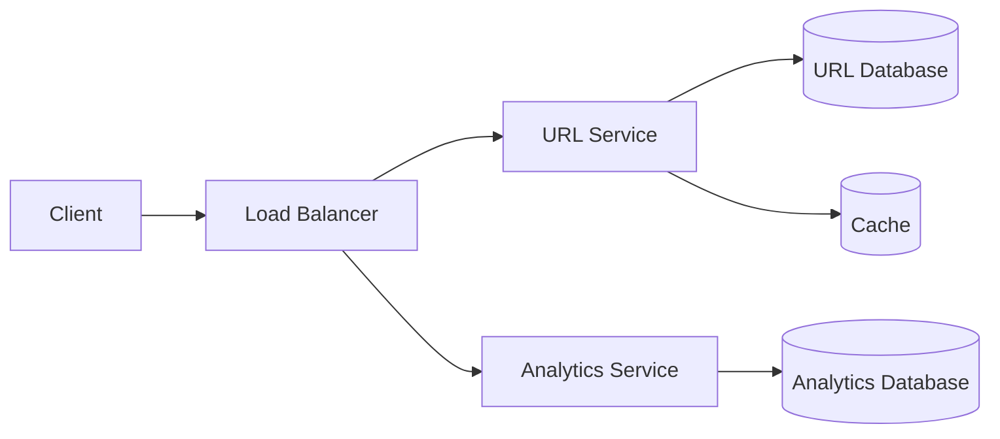

# 🧩 Breaking Systems Into Components

## From a Single Monolith to Genuine Services

A system's requirements, once clarified, need to translate into an actual set of components — the
real, deployable pieces (services, databases, caches) that together make up the system. This
directly builds toward Microservices Fundamentals, covered in full in the Core Infrastructure
module later in this domain, but starts here with the more basic, foundational question: *how* to
actually decide where the boundaries between components should go.

## A Naive, Single-Service Starting Point

```
For a URL Shortener, functional requirements alone could be
satisfied by ONE single service:
  - handles URL creation
  - handles redirects
  - talks to ONE database
```

Per [Understanding AI Agents](../../../artificial-intelligence/understanding-ai-agents/when-to-use-multi-agent-systems-and-when-not-to.md)'s
"start simple" principle, established earlier in this repository for a genuinely analogous reason —
a single, monolithic service is often the right *starting* architecture, not automatically wrong
just because it's simple.

## When Splitting Into Multiple Services Genuinely Makes Sense

```
As NON-FUNCTIONAL requirements grow more demanding (per
functional-vs-non-functional-requirements.md):
  - URL creation and REDIRECT traffic have GENUINELY different
    load patterns - redirects vastly outnumber creations
  - each could benefit from being scaled INDEPENDENTLY
  - analytics (tracking click counts) is a GENUINELY separate
    concern from the redirect itself
```

This mirrors the same reasoning already established for multi-agent systems, earlier in this
repository — splitting into separate services is justified specifically when distinct parts of the
system have genuinely different scaling needs or responsibilities, not merely because "more
services" feels more sophisticated.

## Identifying Natural Component Boundaries

```
A genuinely useful signal: does this piece of functionality
CHANGE for a DIFFERENT reason than another piece? (directly the
SAME question Single Responsibility, from the LLD domain, asks
of a single CLASS - now applied at the SERVICE level)
```

```
URL Shortener's natural boundaries:
  - URL Service (creation, redirect logic)
  - Analytics Service (click tracking, reporting)
  - User Service (accounts, custom alias ownership)
```

This is a direct, deliberate extension of
[Single Responsibility](../../low-level-design/solid-principles/single-responsibility-principle.md),
from the LLD domain — the exact same "one reason to change" question that identifies a class's
proper boundaries also identifies a *service's* proper boundaries, simply applied at a larger
scale.

## Drawing the High-Level Architecture



This is genuinely the standard first artifact produced in an HLD discussion — a high-level
component diagram, deliberately without implementation detail, communicating the overall shape of
the system before any single piece is designed in depth.

## Common Mistakes

- Splitting a system into many small services from the very start, before genuine scaling or
  ownership needs actually justify the added operational complexity — directly the same premature
  complexity already warned against for multi-agent AI systems, earlier in this repository.
- Drawing component boundaries around organizational structure (which team owns what) rather than
  genuine functional and scaling boundaries.
- Never revisiting component boundaries as a system's actual real-world usage patterns become
  clearer over time.

## ➡️ Next

Continue to [capacity-estimation-basics.md](capacity-estimation-basics.md) to see how to put real
numbers behind a design like this.
