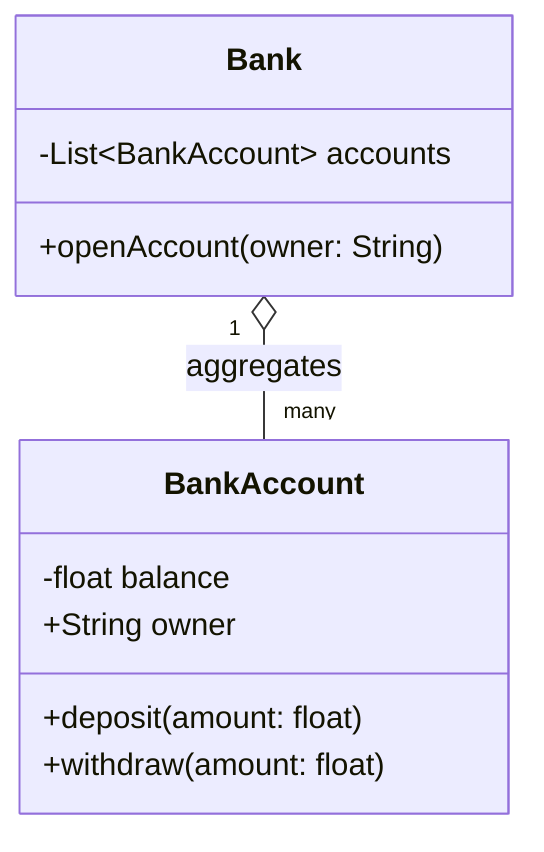
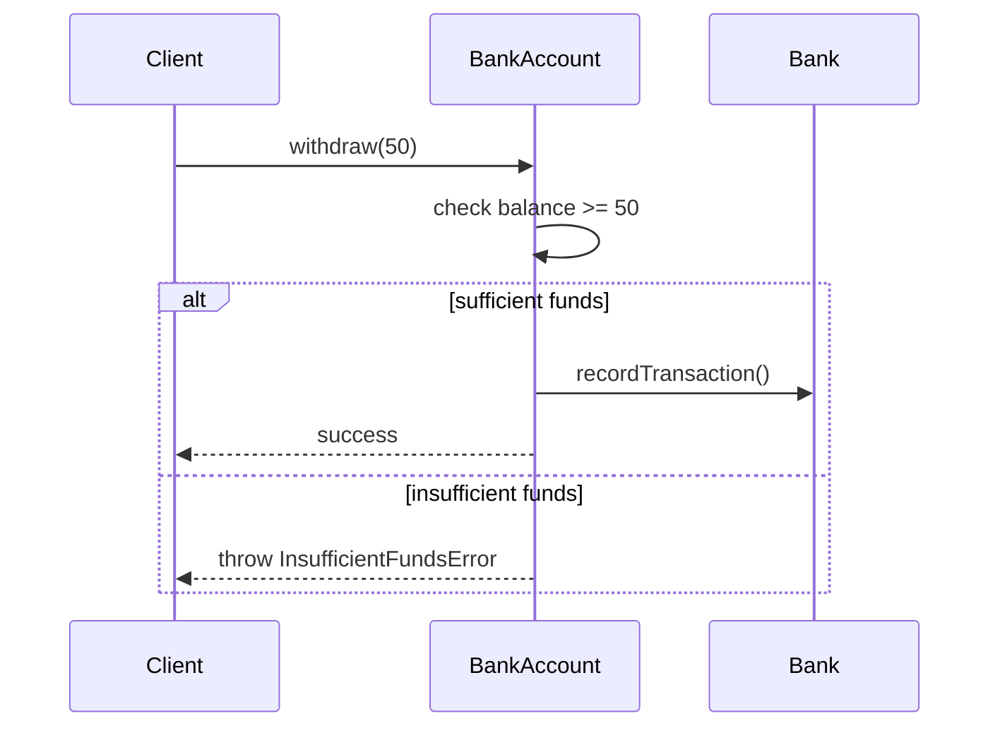

# 📐 UML Basics: Class and Sequence Diagrams

## A Shared Visual Language for Design

**UML (Unified Modeling Language)** is a standardized notation for visualizing a system's design —
this file covers the two diagram types genuinely most relevant to LLD: **class diagrams**
(structure — what classes exist, and how they relate) and **sequence diagrams** (behavior — how
objects actually interact, in order, over time).

## Class Diagrams: Visualizing Structure



A class box has three sections: the class **name**, its **attributes**, and its **methods** — each
attribute/method prefixed with a visibility symbol: `+` for public, `-` for private, `#` for
protected. This is the same [encapsulation](objects-and-classes.md) concept already covered,
now expressed in a standard, shared visual notation.

## Notating Relationships

```
Association    → a plain line:            ClassA --> ClassB
Aggregation    → an open diamond:          ClassA o-- ClassB
Composition    → a filled diamond:         ClassA *-- ClassB
Inheritance    → a hollow triangle arrow:  ChildClass --|> ParentClass
```

Each of these directly notates the exact relationship types already covered in
[relationships-between-objects.md](relationships-between-objects.md) — a class diagram is, in a
genuine sense, simply that file's concepts made visual and precise.

## Sequence Diagrams: Visualizing Behavior Over Time



Each vertical line (a **lifeline**) represents one object, existing over time; horizontal arrows
represent **messages** (method calls) between them, read top-to-bottom in the actual order they
occur. This is genuinely useful for a scenario a class diagram alone can't clearly express — the
*specific sequence* of calls involved in one particular operation, including branching logic (the
`alt`/`else` block above) for different outcomes.

## When to Use Which Diagram Type

```
CLASS diagram   → "what classes exist, and how are they related?"
                  - the STATIC structure

SEQUENCE diagram → "in THIS specific scenario, what calls happen,
                  in what ORDER?" - the DYNAMIC behavior
```

A class diagram alone can't show *how* a withdrawal actually proceeds step-by-step, and a sequence
diagram alone can't show the *overall* structure of every class in a system — these are genuinely
complementary views, each answering a different design question.

## UML in Practice: A Communication Tool, Not a Rigid Specification

```
Real teams RARELY produce fully exhaustive, formal UML for an
entire system - a QUICK class or sequence sketch, focused on ONE
specific, genuinely tricky design decision, is far more common
and far more valuable in practice.
```

This is a genuinely important, practical note: UML's real value in most modern teams is as a
lightweight communication tool for a specific design discussion — like the Mermaid diagrams used
throughout this file — not as exhaustive, formal documentation produced for its own sake.

## Common Mistakes

- Treating UML as a rigid specification requiring exhaustive, complete diagrams for an entire
  system, rather than a lightweight tool for communicating one specific design decision.
- Confusing a class diagram's relationship notation (aggregation vs. composition's diamond styles),
  losing the precise lifecycle distinction each one is meant to convey.
- Using a sequence diagram to try to express overall system structure, when a class diagram is the
  right tool for that specific question.

## ➡️ Next

Continue to [designing-clean-interfaces.md](designing-clean-interfaces.md) to see how these
concepts come together in the actual design of a class's public-facing API.
