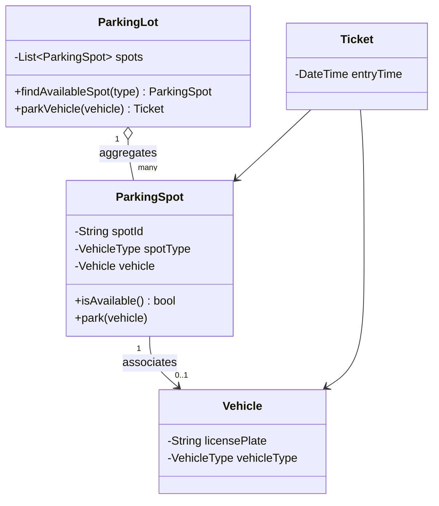

# 🏗️ Class Design

## From Entities to Actual Classes

[requirement-analysis.md](requirement-analysis.md) identified the Parking Lot system's core
entities: `ParkingLot`, `ParkingSpot`, `Vehicle`, and `Ticket`. This file turns them into actual,
working classes — directly applying [objects-and-classes.md](../lld-foundations/objects-and-classes.md)
and [relationships-between-objects.md](../lld-foundations/relationships-between-objects.md), both
from earlier in this domain.

## Modeling `Vehicle` With Polymorphism

```python
from enum import Enum

class VehicleType(Enum):
    MOTORCYCLE = "motorcycle"
    CAR = "car"
    TRUCK = "truck"

class Vehicle:
    def __init__(self, license_plate: str, vehicle_type: VehicleType):
        self.license_plate = license_plate
        self.vehicle_type = vehicle_type
```

## Modeling `ParkingSpot`, and Its Relationship to `Vehicle`

```python
class ParkingSpot:
    def __init__(self, spot_id: str, spot_type: VehicleType):
        self.spot_id = spot_id
        self.spot_type = spot_type
        self.vehicle: Vehicle | None = None   # ASSOCIATION, not composition -
                                                 # a Vehicle exists independently
                                                 # of any specific spot

    def is_available(self) -> bool:
        return self.vehicle is None

    def park(self, vehicle: Vehicle):
        if not self.is_available():
            raise ValueError(f"Spot {self.spot_id} is already occupied")
        self.vehicle = vehicle

    def remove_vehicle(self):
        self.vehicle = None
```

This is a direct, deliberate application of
[relationships-between-objects.md](../lld-foundations/relationships-between-objects.md) — `ParkingSpot`
holds an *association* with `Vehicle`, not composition: a vehicle's lifecycle genuinely doesn't
depend on any one specific spot.

## Modeling `ParkingLot`: the Coordinating Class

```python
class ParkingLot:
    def __init__(self, spots: list[ParkingSpot]):
        self._spots = spots

    def find_available_spot(self, vehicle_type: VehicleType) -> ParkingSpot | None:
        for spot in self._spots:
            if spot.spot_type == vehicle_type and spot.is_available():
                return spot
        return None

    def park_vehicle(self, vehicle: Vehicle) -> "Ticket":
        spot = self.find_available_spot(vehicle.vehicle_type)
        if spot is None:
            raise ValueError("No available spot for this vehicle type")
        spot.park(vehicle)
        return Ticket(vehicle, spot)
```

`ParkingLot` genuinely *aggregates* a list of `ParkingSpot` objects — directly applying
[Single Responsibility](../solid-principles/single-responsibility-principle.md), earlier in this
domain: `ParkingLot`'s one responsibility is coordinating spot allocation, while each `ParkingSpot`
manages only its own, individual occupancy state.

## Modeling `Ticket`

```python
from datetime import datetime

class Ticket:
    def __init__(self, vehicle: Vehicle, spot: ParkingSpot):
        self.vehicle = vehicle
        self.spot = spot
        self.entry_time = datetime.now()
        self.exit_time: datetime | None = None
```

`Ticket` exists specifically to carry the state needed to calculate a fee later — a deliberate,
minimal class whose entire responsibility is recording *when* and *where* a vehicle parked.

## Drawing This as a Class Diagram



Directly applying [uml-basics.md](../lld-foundations/uml-basics.md), earlier in this domain — this
diagram communicates the entire structural design at a glance, well before diving into every
method's implementation detail.

## Common Mistakes

- Modeling a genuine association (like `ParkingSpot`-to-`Vehicle`) as composition, accidentally
  coupling their lifecycles together when they should remain independent.
- Giving `ParkingLot` too many responsibilities (fee calculation, spot allocation, ticket
  generation, payment processing all in one class), directly violating Single Responsibility.
- Skipping a class diagram sketch entirely, jumping straight into code without first communicating
  or verifying the overall structure.

## ➡️ Next

Continue to
[extensibility-and-maintainability.md](extensibility-and-maintainability.md) to see how this design
handles genuinely new requirements without being rewritten.
